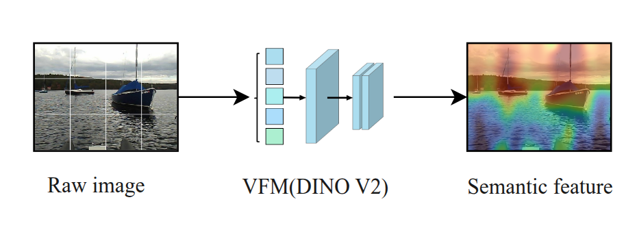

# SAGA-3D

## Semantic-Aligned Geometric Augmentation for Maritime 3D Detection

Tengfei Xie

Zhejiang University

> Focus: <strong>robust camera-LiDAR 3D perception for USVs</strong>

---

# 3D Perception: Road vs. Sea

## Autonomous Driving

- Mature benchmarks: KITTI, nuScenes, Waymo.
- Strong detectors are now well established.

## Maritime Autonomy

- Maritime 3D perception is still emerging.
- Waves, reflections, and platform motion dominate.

<strong>Gap: mature road-side 3D perception cannot be directly transferred to the sea.</strong>

---

# Misalignment Breaks Fusion

## Sensor-Side Disturbances

- Calibration errors
- Mechanical vibration
- Temperature / structure drift
- Wave-induced motion

## Environment-Side Degradation

- Reflection and illumination changes
- Occlusion, fog, distant targets
- Sparse LiDAR returns
- Unstable visual structure

<!-- <strong>Key problem: misaligned fusion turns semantic cues into noise.</strong> -->

---

# Semantic Consistency Formulation

## Inputs

## Projection and Sampling

SAGA-3D refines $\hat{T}$ by maximizing semantic agreement:

$$
\hat{T}=\arg\max_T \sum_{i=1}^{N} S(f_i)
$$

<strong>Reformulation: alignment as semantic consistency optimization.</strong>

---

# SAGA-3D Framework

1. Extract frozen VFM features.2. Project LiDAR with current extrinsics.
2. Score semantic consistency.4. Refine alignment before detection.

<!-- <strong>Design emphasis: align first, then detect.</strong> -->

> Fig: VFM features, semantic-guided alignment, and 3D detection.

---

# VFM Semantics

## Limits of Low-Level Cues

- Sensitive to reflection and lighting
- Weak for distant small targets
- Fragile under occlusion
- Limited with sparse LiDAR

## Role of VFM Semantics

- High-level semantic embeddings
- More invariant visual cues
- Stronger alignment target
- Frozen reusable prior

<strong>VFM features guide geometry, not just image fusion.</strong>

---

# Confidence-Aware Alignment

## Semantic Similarity

Compare projected LiDAR features with image features:

$$
S_i=\frac{f_i^{LiDAR}\cdot f_i^{Image}}
{\|f_i^{LiDAR}\|\|f_i^{Image}\|}
$$

Cosine similarity measures cross-modal agreement.

## Weighted Objective

Use reliability weight $w_i$:

$$
L(T)=-\sum_{i=1}^{N}w_iS_i
$$

Reliable matches dominate; noisy matches are suppressed.

<strong>Why it matters: weights protect alignment from noisy observations.</strong>

---

# Experiment Setup

## Dataset Overview

- SeePerSea benchmark
- In-water object scenes
- Maritime multi-sensor data
- Used for BEV and 3D detection

## Evaluation

- **TED-S**: LiDAR-only
- **TED-S + NSA**: naive semantics
- **SAGA-3D**: adaptive alignment
- IoU thresholds: 0.5 / 0.7
- Same protocol; RTX 3090 GPU and i9-14900 CPU.

  > Image source: SeePerSea dataset paper / website, Jeong et al., IEEE T-FR 2025, 
  DOI: 10.1109/TFR.2025.3602937.

---

# Quantitative Results
<strong>semantics without alignment can hurt BEV.</strong>
<table class="results-table">
  <thead>
    <tr>
      <th>Method</th>
      <th>Modality</th>
      <th>BEV@0.5</th>
      <th>BEV@0.7</th>
      <th>3D@0.5</th>
      <th>3D@0.7</th>
    </tr>
  </thead>
  <tbody>
    <tr>
      <td>TED-S</td>
      <td>L</td>
      <td>65.16</td>
      <td>64.97</td>
      <td>51.84</td>
      <td>49.81</td>
    </tr>
    <tr>
      <td>TED-S + NSA</td>
      <td>L+C</td>
      <td>64.54</td>
      <td>62.23</td>
      <td>55.88</td>
      <td>53.63</td>
    </tr>
    <tr>
      <td><strong>SAGA-3D</strong></td>
      <td>L+C</td>
      <td><strong>77.28</strong></td>
      <td><strong>74.81</strong></td>
      <td><strong>68.06</strong></td>
      <td><strong>65.81</strong></td>
    </tr>
  </tbody>
</table>

<strong>+12.12 BEV mAP@0.5 over TED-S.</strong>

<strong>+16.22 3D mAP@0.5 over TED-S.</strong>

<strong>NSA shows semantics alone are insufficient.</strong>

---

# Qualitative Results
<strong>Better alignment leads to tighter 3D boxes.</strong>

baseline left; SAGA-3D right.

baseline top; SAGA-3D bottom.

---

# Conclusion and Future Work

## Problem

Fusion is degraded by motion, environment, and calibration uncertainty.

## Method

Alignment is optimized by weighted semantic consistency.

## Result

SAGA-3D improves BEV and 3D mAP on SeePerSea.

## Future work

 extreme sea states and lightweight real-time alignment.

> Thank you
